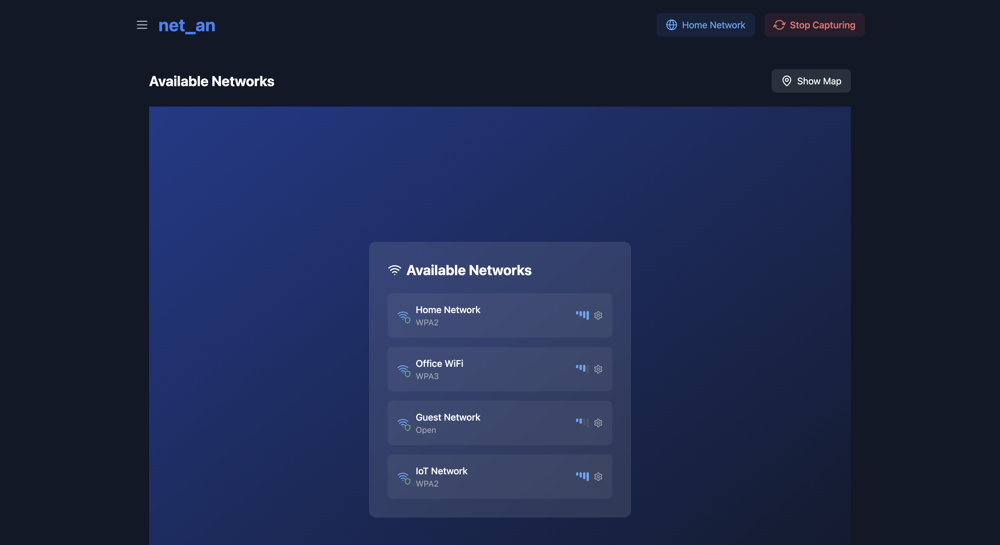

# Net_An - Network Analyzer

A modern, real-time network analysis tool built with React, Three.js, and TypeScript. Visualize and monitor network traffic with an intuitive and beautiful interface.



## Features

- 🌐 Real-time network traffic monitoring
- 📊 3D visualization of network connections
- 🗺️ Geographic network mapping
- 📈 Performance metrics tracking
- 🔒 Network security information
- 📱 Responsive design
- ⚡ Built with modern web technologies

## Tech Stack

- React
- TypeScript
- Three.js (@react-three/fiber)
- Mapbox GL
- TailwindCSS
- Vite
- Lucide Icons

## Getting Started

### Prerequisites

- Node.js (v16 or higher)
- npm or yarn

### Installation

1. Clone the repository:
   ```bash
   git clone https://github.com/yourusername/net_an.git
   cd net_an
   ```

2. Install dependencies:
   ```bash
   npm install
   # or
   yarn install
   ```

3. Start the development server:
   ```bash
   npm run dev
   # or
   yarn dev
   ```

4. Open [http://localhost:5173](http://localhost:5173) in your browser

### Building for Production
   ```bash
   npm run build
   # or
   yarn build
   ```

5. Serve the built files:
   ```bash
   npm run serve
   # or
   yarn serve
   ```


## Usage

1. Connect to a network from the available networks list
2. Monitor real-time network statistics
3. View 3D network visualization
4. Track resource loading and performance metrics
5. Toggle between map and list views

## Contributing

Contributions are welcome! Please feel free to submit a Pull Request.

1. Fork the project
2. Create your feature branch (`git checkout -b feature/AmazingFeature`)
3. Commit your changes (`git commit -m 'Add some AmazingFeature'`)
4. Push to the branch (`git push origin feature/AmazingFeature`)
5. Open a Pull Request

## License

This project is licensed under the MIT License - see the [LICENSE](LICENSE) file for details.

## Creator

NEHAL MR
- [GitHub](https://github.com/nehalmr)
- [LinkedIn](https://linkedin.com/in/nehalmr)

## Acknowledgments

- [React Three Fiber](https://docs.pmnd.rs/react-three-fiber) for 3D visualization
- [Mapbox GL](https://docs.mapbox.com/mapbox-gl-js/) for mapping capabilities
- [TailwindCSS](https://tailwindcss.com/) for styling
- [Lucide](https://lucide.dev/) for icons